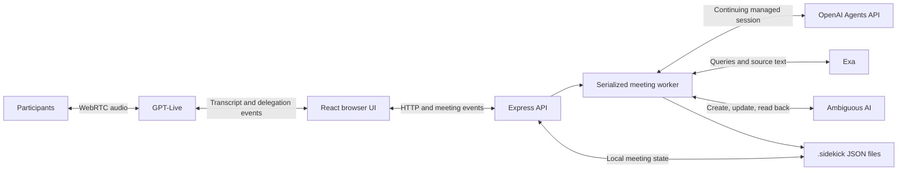

# Sidekick Architecture

Sidekick is a local React/Vite application served by an Express process. Voice and background work have separate lifecycles, so research and native document, presentation and spreadsheet writes can continue while participants speak. [Setup readiness](setup-readiness.md) records which paths have been tested.

## Components

| Component | Responsibility | Main files |
| --- | --- | --- |
| Meeting UI | Start and close meetings, show listening state, accept written contributions, filter files by format, render native previews and records, export Markdown. | `src/App.tsx`, `src/components/ArtifactPreview.tsx`, `src/lib/api.ts` |
| Voice connection | WebRTC audio, transcript fragments, client delegation, mute, autoplay recovery, graceful close. | `src/lib/live.ts`, `src/hooks/useMeetingVoice.ts`, `server/providers/live.ts` |
| Application API | Local-origin checks, input validation, meeting routes, event stream, voice session broker. | `server/app.ts`, `server/index.ts` |
| Meeting worker | Serialize work per meeting, process conversation revisions, run research, publish native artifacts and final records. | `server/worker.ts` |
| Managed agent adapter | Create or continue the Agents API session; handle completion, cancellation, stream recovery, and saved output. | `server/providers/agents.ts`, `server/prompts.ts` |
| Research and workspace | Exa search; Ambiguous AI create/update/readback, inbound native snapshots and comments, guarded merges and conflict review. | `server/providers/exa.ts`, `server/providers/ambiguous.ts` |
| Domain and persistence | Validate model output and formulas, check human evidence, retain meeting state, generate handover Markdown. | `shared/schema.ts`, `shared/types.ts`, `shared/spreadsheet.ts`, `server/domain.ts`, `server/store.ts` |

## Data Flow

The server brokers the browser's SDP offer through `POST /v1/live/sessions`, configuring `gpt-live-1` with client delegation. Audio uses negotiated WebRTC tracks; transcript and control events use the data channel. The browser receives the session ID and SDP answer, while the OpenAI project key stays on the server. This follows the [GPT-Live WebRTC contract](https://developers.openai.com/api/docs/guides/voice-webrtc?api=live).

Transcript fragments and written contributions become the meeting's context. Human contributions increment its revision. The browser flushes available fragments before a delegation request; a delegation ID routes the work and deduplicates repeated results. It does not contain a complete task prompt. The worker builds the task from the saved conversation. Verified backend results return as GPT-Live context or spoken commentary, following the [client-delegation flow](https://developers.openai.com/api/docs/guides/live-delegation).

## One Continuing Work Session

Each meeting retains a current Agents API session ID. The adapter uses native HTTP with `OpenAI-Beta: agents=v1`, default model `gpt-6-astra`, `reasoning: {effort: "low"}`, `service_tier: "fast"`, and `environment: {type: "none"}`. It uses the managed session API documented in the [quickstart](https://developers.openai.com/api/docs/guides/agents-api/quickstart) and [session guide](https://developers.openai.com/api/docs/guides/agents-api/sessions).

Instructions and model settings are configured at session creation. The worker tracks `agentInstructionsVersion`; version 4 applies the low-reasoning, Fast default. A meeting with an older configuration starts one new managed session on its next work pass, supplying the full saved transcript and current state. The old ID is retained in `previousAgentSessionIds`, and existing local keys, native resource IDs, sources and drafts remain intact. Subsequent passes continue the new session. This migration applies the current instructions and defaults without pretending that the earlier session's creation-time settings have changed.

An analysis returns structured proposals: title, summary, decisions with human evidence, pending questions, ambiguities, follow-ups, native artifact drafts, up to two selected research queries, and an optional short spoken response. The application validates the response before applying it.

For research, the worker deduplicates and caps the proposed queries at two per iteration. It calls [Exa search](https://exa.ai/docs/reference/search), retaining source titles, URLs, and retrieved text. It then continues the same Agents API session with the actual findings and errors to revise the documents. The application owns execution of the search and publication steps; no direct model tools or specialist subagents are configured.

The adapter subscribes before sending a follow-up, and accepts completion only from the root turn. An idle session or closed stream does not establish success. After a dropped stream, it reconnects and reconciles saved turn state without submitting the task again. Final text comes from the completed turn's saved items. Cancellation uses an explicit remote cancel event; closing a socket alone does not cancel work. See [events and recovery](https://developers.openai.com/api/docs/guides/agents-api/sessions/events).

## Native Artifact Contract

The `documents` collection holds all three formats. `kind` describes the purpose (`research`, `comparison`, `proposal`, `plan`, or `notes`); `format` selects `document`, `presentation`, or `spreadsheet`. Older stored drafts without `format` remain ordinary documents. A stable key keeps the same format and external resource on revision. Changing format creates a separate artifact rather than converting an existing shared file.

The agent chooses a format suited to useful work: a written explanation or research brief, a deck for an audience, or a sheet for calculations and structured information. It creates decks and sheets when useful or requested, not every format by default. Every artifact includes meaningful Markdown `content`: the complete document body for Docs, or an overview with assumptions and limitations for Slides and Sheets. Native payloads contain the substantive slide or sheet content; the overview is not a substitute for them.

The Markdown overview stays in Sidekick. Native source URLs and assumptions belong in the relevant slide notes or sheet cells, with caveats that affect a conclusion also visible in slide bullets. The provider preserves those supplied notes and cell values rather than deriving native citations from the overview.

| Format | Validated content | Workspace representation |
| --- | --- | --- |
| Document | Markdown body, up to 60,000 characters. | Native Doc using the workspace's canonical document representation. |
| Presentation | 1–16 source slides; title up to 120 characters, up to 5 bullets of 240 characters each, optional notes up to 4,000 characters. | Editable text on a 16:9 slide canvas with speaker notes. Dense bullet lists are split into continuation slides, so native slide count can exceed source slide count. |
| Spreadsheet | 1–6 uniquely named sheets, 1–20 uniquely keyed columns and 1–200 data rows per new sheet (201 native rows including the header after import); text, finite numbers, booleans or null cells; serialized payload up to 120,000 characters. | Native workbook with visible column labels, typed values, and formulas. Column types are text, number, currency, date, boolean, or formula. |

Unknown spreadsheet inputs remain blank (`null`); zero and false retain their values. Numbers remain numeric, and currency units belong in headings or nearby context. Calculated values use `=` formulas with local A1 references, ranges, arithmetic, comparisons, quoted strings and same-workbook sheet references. The allowlist is `SUM`, `AVERAGE`, `MIN`, `MAX`, `COUNT`, `COUNTA`, `COUNTIF`, `SUMIF`, `ROUND`, `ROUNDUP`, `ROUNDDOWN`, `ABS`, `IF`, `IFERROR`, `AND`, `OR`, and `NOT`. External workbook links, data-fetch functions, macros, DDE and unrecognized functions are rejected by the schema.

In the model payload, A/B/C follow column order and row 1 is the first **data** row; column labels are separate metadata. The provider prepends a visible header as native row 1 and uses `shiftFormulaForHeader` to move A1 row references down by one, including absolute, range and cross-sheet references while preserving quoted strings. For example, a payload total `=SUM(B1:B5)` is saved as `=SUM(B2:B6)`. The local preview uses the same helper and native row numbers. It shows formula expressions without evaluating them; Ambiguous AI calculates the native results.

After native readback, `spreadsheet.nativeCoordinates:true` preserves every actual row, including the visible header, with A/B/C column keys. Formulas already use native coordinates and are never shifted again. Imported unknown formulas remain in the preview and canonical snapshot; the model omits artifacts outside its editable contract rather than deleting unsupported human content.

The browser previews slide content and notes with keyboard navigation, and sheets with accessible tabs, scrolling and 100 data rows per page. Search includes every slide and sheet, including off-screen content. The local slide preview follows source slides; the native editor may include continuation slides. **Export meeting** is a Markdown record containing draft content and workspace links. There is no PPTX or XLSX export.

## Changing Direction and Closing

Only one worker runs per meeting. New conversation can arrive during reasoning, research, or a workspace save. The worker finishes bounded work and revisits the newest revision.

When an analysis reflects an older revision, useful artifacts can still appear with a prominent earlier-snapshot notice. Their status is forced to draft, and that analysis does not replace current decisions or the meeting record. Native Slides and Sheets also carry an earlier-draft suffix in the workspace title because their editor does not render the Markdown overview. A subsequent pass revises the same resource identities using the latest conversation. This lets participants inspect useful work during sustained discussion.

Closing ends the voice connection, flushes the remaining transcript, and switches the meeting to handover. The worker starts no new investigations, retains research that already completed, and uses the latest context. Documents still in draft become incomplete in the final record. A failure preserves prior saved work and exposes the outstanding error.

## Evidence and Workspace Truth

The model is instructed to distinguish suggestions, disagreements, explicit decisions, and commitments. The domain layer checks decision evidence against human transcript text; unsupported decisions become pending confirmations. Follow-ups without supporting evidence remain proposed, and ownership is removed when the evidence does not establish the supplied name. These checks support the model's semantic judgment; quote matching alone cannot prove consensus or identify a speaker.

Artifacts have stable local keys and external IDs. Content readiness (`draft`, `complete`, or `incomplete`) is independent of persistence (`local`, `saving`, `saved`, or `failed`). The meeting record lists every output with these statuses and its confirmed native workspace link (`/docs/`, `/slides/`, or `/sheets/`).

Ambiguous AI publication uses `POST /api/documents`, `PATCH /api/documents/:id`, and a subsequent `GET`, with native types `doc`, `slide`, or `sheet`. Markdown is converted to canonical document content; Slides and Sheets use their structured canvas data. Native saves also read the relevant slide or sheet editor's data endpoint and verify authored values, while allowing provider-added formatting defaults and spare columns. Sidekick persists the returned identity and available canonical content, or the exact native write candidate when the response omits content, before final readback. Retries can then retain resource identity after a partial failure. See the [official API schema](https://app.ambiguous.ai/api/openapi.json) and [authentication guide](https://www.ambiguous.ai/auth.md).

`WorkspaceSync` serializes reads and writes per meeting while allowing reads during model analysis. It stores complete native snapshots privately and projects native document text, slide text/notes and sheet values into public previews. Body, title and comment changes increment a workspace revision; the worker checks that revision around analysis and refreshes immediately before publication. An unseen native edit invalidates the stale plan. Browser snapshots have a monotonic `stateVersion` so an older HTTP response cannot overwrite newer SSE state.

The browser refreshes the selected file or current meeting on open/focus, every 30 seconds during active meetings while visible, or explicitly. Requests are deduplicated and repeated failures back off to two minutes. Server refreshes are coalesced for five seconds unless forced. Ended meetings only refresh their view; an explicit feedback update starts a closing pass with no new research. Native comments are read as feedback, never accepted as transcript evidence of a collective decision or assignment. A human form explicitly posts a new comment or reply through the native comments API.

Before every write, the provider compares the current full native content and title with the frozen source snapshot. Files that have never been edited externally can be regenerated normally. Once an external edit is detected, a persistent flag requires supported field merges for every subsequent save: native sheet values/formulas, slide text/notes, or document text leaves. Raw native fields retain formatting, images and other untouched structure. Structural changes that cannot be mapped safely stop and preserve the proposed draft. Human-edited meeting records also require review so regenerated transcript notes cannot erase native annotations.

The main artifact fields always represent the confirmed workspace copy. `pendingDraft` contains a separate unsaved proposal. Review binds the chosen draft ID to a hash of the workspace title/type/body; a fresh read rejects stale choices. Keep clears the proposal locally. Apply uses the reviewed proposal's original source projection to replace overlapping fields while retaining unrelated edits, then verifies the saved result. No API atomic compare-and-swap is documented: a native edit between the final read and PATCH can still race. This implementation uses polling, without webhooks or cursor-level collaborative editing.

## Persistence and Boundaries

The store writes each meeting through a temporary file and rename in `.sidekick/`, using restrictive permissions. It retains transcripts, sources, drafts, state revisions, external document identities, and agent session continuity. Browser responses omit internal provider session IDs and canonical workspace comparison state. After a process restart, interrupted work is marked for a visible retry rather than silently reported as completed.

The app binds to `127.0.0.1`, checks local hosts and request origins, and has no login system. It is designed for one local process and one shared local workspace. It has no distributed job queue, encrypted local storage, speaker diarization, prior-meeting context retrieval, autonomous follow-up execution, or public hosting configuration. Presentations currently use editable text layouts, not a general slide design or image-generation engine. The native Sheets editor did not visibly apply requested cell styling in browser checks, although the API retained it; visible headers and values rendered correctly.

The scripted demo uses the same UI and local store with explicit simulation labels. Its four stages produce two ordinary documents, a two-slide briefing with notes, and a budget workbook with Budget and Open questions tabs. It bypasses external providers and must not be presented as proof of live integration.
